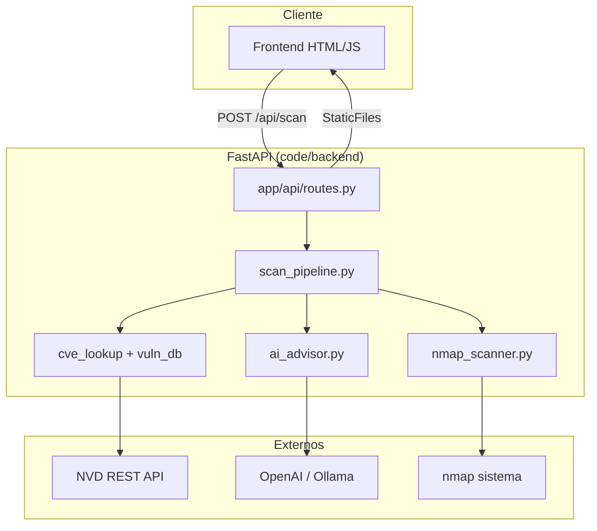

# Arquitectura general

#recontool #arquitectura

Relacionado: [[Flujo-de-datos]] · [[Mapa-del-repositorio]] · [[../03-Backend/Backend-overview]] · [[../04-Frontend/Frontend-overview]]

---

## Diagrama lógico

---

## Capas

| Capa | Ubicación | Responsabilidad |
|------|-----------|-----------------|
| Presentación | `code/frontend/` | Búsqueda IP, tabla puertos, panel IA |
| API | `app/api/routes.py` | Endpoints REST, validación Pydantic |
| Orquestación | `app/services/scan_pipeline.py` | Orden nmap → CVE → IA |
| Dominio / servicios | `app/services/*` | Lógica de negocio aislada |
| Configuración | `app/core/config.py` + `.env` | Rutas, claves, argumentos nmap |
| Datos | `data/vulnerabilities.json` | CVEs curados para labs |

---

## Punto de entrada

- **Proceso**: `python run.py` → uvicorn `app.main:app`
- **Puerto por defecto**: `127.0.0.1:8000`
- **Sirve**: API bajo `/api/*` y frontend en `/`

Ver [[../05-Operaciones/Instalacion-y-ejecucion]].

---

## Principios de diseño actuales

1. **Modularidad**: cada servicio en un archivo bajo `app/services/`.
2. **Sin base de datos** (por ahora): todo en memoria + JSON en respuesta HTTP.
3. **Fail-soft en IA**: si no hay clave, el scan sigue; `ai_analysis.enabled = false`.
4. **Un solo binario de despliegue**: FastAPI sirve API + estáticos.

---

## Dependencias externas obligatorias

| Dependencia | Uso |
|-------------|-----|
| Python 3.10+ | Tipado `dict \| None` en algunos módulos |
| nmap (sistema) | Escaneo real |
| python-nmap | Wrapper Python |
| Red saliente | NVD y LLM (si se usan) |

---

## Enlaces

- [[Flujo-de-datos]]
- [[../03-Backend/Pipeline-de-escaneo]]
- [[../06-Reglas/Que-tocar-y-que-no]]
