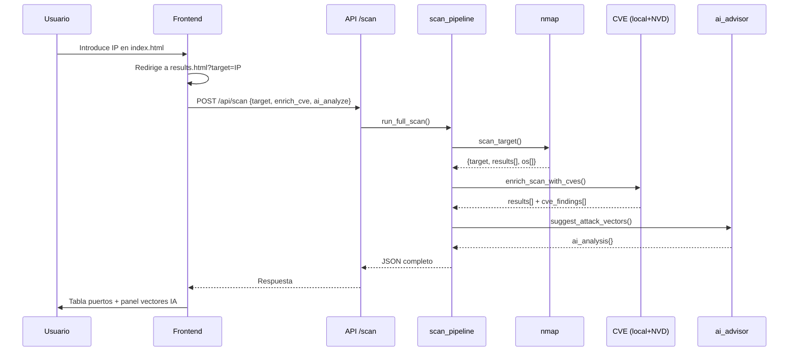

# Flujo de datos

#recontool #arquitectura #flujo

Relacionado: [[Arquitectura-general]] · [[../03-Backend/API]] · [[../03-Backend/Pipeline-de-escaneo]]

---

## Flujo principal (usuario escanea una IP)



---

## Estructura JSON de respuesta (`POST /api/scan`)

```json
{
  "target": "10.10.x.x",
  "results": [
    {
      "host": "10.10.x.x",
      "port": 80,
      "state": "open",
      "service": "http",
      "product": "Apache httpd",
      "version": "2.4.7",
      "extra_info": "",
      "vulnerability": { "cve": "...", "cvss": 10.0, "severity": "Critical", "description": "..." },
      "cve_findings": [
        { "cve": "CVE-....", "cvss": 9.8, "severity": "CRITICAL", "description": "...", "source": "nvd" }
      ]
    }
  ],
  "os": [
    { "name": "Linux 3.x", "accuracy": "90" }
  ],
  "ai_analysis": {
    "enabled": true,
    "provider": "ollama",
    "model": "llama3.2",
    "analysis": {
      "summary": "...",
      "vectors": [ { "title": "...", "priority": "high", "rationale": "...", "suggested_checks": [], "related_ports": [80] } ],
      "next_steps": ["..."]
    }
  }
}
```

En error de nmap: `{ "error": "mensaje" }` sin el resto de campos.

---

## Flujos alternativos

### Solo enriquecer CVE (sin re-escanear)

`POST /api/enrich` con body `{ "scan_data": { ... resultado previo ... } }`

Útil si guardas JSON y quieres actualizar CVEs sin repetir nmap.

### Solo IA (sin re-escanear)

`POST /api/analyze` con el mismo body.

Útil para probar prompts o modelos sin esperar nmap.

---

## Caché y rate limits

| Recurso | Comportamiento |
|---------|----------------|
| NVD | Caché en memoria por keyword; delay ~6.2s sin API key |
| nmap | Sin caché; cada scan es completo |
| IA | Sin caché; cada llamada envía JSON completo del scan |

---

## Datos que NO persisten (v0.1)

- No hay historial en disco.
- No hay sesiones de usuario.
- `.env` no se commitea (solo `.env.example`).

Futuro: [[../07-Futuro/Auditoria-y-trazabilidad-IA]].

---

## Enlaces

- [[../03-Backend/Servicio-nmap]]
- [[../03-Backend/Servicio-CVE-NVD]]
- [[../03-Backend/Servicio-IA]]
